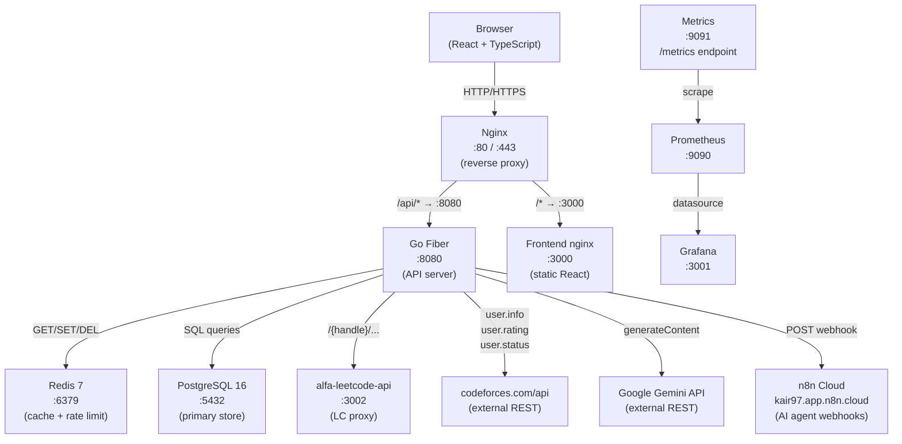

# OlympIQ — Architecture

---

## System Diagram



---

## Docker Services and Ports

| Service | Image | Host Port | Container Port | Purpose |
|---------|-------|-----------|----------------|---------|
| postgres | postgres:16-alpine | — | 5432 | Primary database |
| redis | redis:7-alpine | — | 6379 | Cache + rate limiting |
| leetcode-api | alfaarghya/alfa-leetcode-api:2.0.4 | 3002 | 3000 | LeetCode API proxy |
| backend | ./backend Dockerfile | 8080, 9091 | 8080, 9091 | Go Fiber API + metrics |
| frontend | ./frontend Dockerfile | 3000 | 3000 | React static (served by nginx) |
| nginx | nginx:alpine | 80 | 80 | Reverse proxy |
| prometheus | prom/prometheus:latest | 9090 | 9090 | Metrics collection |
| grafana | grafana/grafana:latest | 3001 | 3000 | Metrics dashboard |

Nginx resolves backend/frontend by Docker hostname with lazy DNS (`resolver 127.0.0.11 valid=5s`) to survive service restarts.

---

## Request Lifecycle: Login

```
1. Browser POST /api/v1/auth/login  {email, password}
2. Nginx proxy_pass → backend:8080/api/v1/auth/login
3. RateLimit middleware → check Redis key ratelimit:auth:{ip}:POST (max 10/min)
4. AuthHandler.Login() → parseAndValidate(LoginInput)
5. AuthService.Login() → users.FindByEmail(email)
6. bcrypt.CompareHashAndPassword(hash, password)
7. issueTokenPair() → sign JWT RS256 access token + generate 32-byte hex refresh token
8. Store refresh token hash (SHA256) in refresh_tokens table
9. Set httpOnly cookies: access_token (TTL: 2h), refresh_token (TTL: 7d, Path: /api/v1/auth)
10. Return 200 {id, email, username}
```

---

## Request Lifecycle: Sync (POST /accounts/sync)

```
1. Browser POST /api/v1/accounts/sync  (with access_token cookie)
2. Nginx → Backend
3. RateLimit (60/min api) + Auth middleware → read cookie → ParseAccessToken JWT → set Locals[userID]
4. AccountsHandler.Sync() → StatsService.SyncAll(userID)
5. platforms.ListByUserID(userID)   → SQL: SELECT from platform_accounts
6. For each platform:
   a. codeforces:
      - CodeforcesService.GetUserInfo(handle)  → check Redis cf:info:{handle} → GET codeforces.com/api/user.info
      - CodeforcesService.GetSubmissions(handle, 500) → Redis cf:status:{handle} → API
      - CodeforcesService.GetRatingHistory(handle) → Redis cf:rating:{handle} → API
      - Build tag frequency map from verdict=="OK" submissions
      - Extract last 24 rating history points
      - INSERT into user_stats
   b. leetcode:
      - LeetCodeService.GetProfile → Redis lc:profile:{handle} → leetcode-api:3000/{handle}/profile
      - GetContest → lc:contest → API
      - GetSkill → lc:skill → API
      - GetCalendar → lc:calendar → API
      - INSERT into user_stats
7. platforms.UpdateLastSynced(userID, platform, now)
8. Return 200 {message: "sync completed"}
```

---

## Request Lifecycle: Generate Roadmap (POST /roadmap/generate)

```
1. Browser POST /api/v1/roadmap/generate  {mode: "weekly"}
2. Auth middleware validates JWT
3. RoadmapHandler.Generate() → parseAndValidate
4. AIService.BuildStudentContext(userID):
   a. platforms.ListByUserID — load connected accounts
   b. For each account:
      - CF: GetUserInfo, GetSubmissions(500), GetRatingHistory → Redis or live API
      - LC: GetProfile, GetContest, GetAcSubmissions, GetSkill → Redis or live API
   c. goals.FindByUserID
   d. Build CFTagFreq map, CFSolvedKeys list, LCTopics map
5. If N8N_ROADMAP_URL is set:
   - callN8NRoadmap(ctx, sc, mode) → POST kair97.app.n8n.cloud/webhook/coding-roadmap
   - Unwrap [{"output":"...json..."}] envelope if present
   - Strip markdown fences
6. Else:
   - callGemini(ctx, roadmapSystemPrompt, buildRoadmapUserMessage(sc, mode))
   - Strip fences
7. Store in roadmaps table (content JSONB)
8. json.Unmarshal the raw JSON → return parsed object
```

---

## Request Lifecycle: Analyze Problem (POST /analyze)

```
1. Browser POST /api/v1/analyze  {problem_url: "https://codeforces.com/..."}
2. Auth middleware validates JWT
3. AnalyzerHandler.Analyze() → validate URL
4. AIService.AnalyzeProblem(ctx, url):
   a. If N8N_ANALYZER_URL is set:
      - callN8NAnalyzer(ctx, url) → POST kair97.app.n8n.cloud/webhook/olympiq-problem-analysis
        Body: {"problem_url": "..."}
      - Unwrap [{"output":"..."}] envelope; strip fences
   b. Else:
      - callGemini(ctx, razborSystemPrompt, "Analyze this problem URL: ...")
5. json.Unmarshal raw string → map[string]interface{}
6. normalizeAnalysis(parsed) — fill safe defaults for missing fields
7. INSERT into analyses table (raw JSON string in analysis_text column)
8. Return 201 {id, analysis: parsed}
```

---

## How n8n Fits Into the Architecture

n8n acts as an AI orchestration layer sitting between the Go backend and the AI models. The backend always sends a structured JSON payload via HTTP POST to the n8n webhook URL. n8n's AI Agent node receives this, calls the AI model (Gemini 2.5 or GPT-4o-mini), and returns the JSON razbor or roadmap.

The key decision: n8n allows swapping AI models without redeploying the backend. If Gemini quota runs out, switch to OpenAI in n8n without changing Go code.

**Fallback behavior:** If `N8N_ANALYZER_URL` or `N8N_ROADMAP_URL` is empty in `.env`, the backend calls Gemini directly via `callGemini()`. Both paths produce identical output.

**Envelope unwrapping:** n8n's default response format when using "When Last Node Finishes" mode is:
```json
[{"output": "{...json string...}"}]
```
The backend `callN8NAnalyzer` and `callN8NRoadmap` functions try multiple key names (`output`, `json`, `text`, `result`, `analysis`) and handle both quoted-string values and raw JSON object values.
